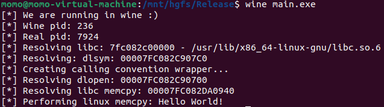

# winescape

A successful attempt at 'escaping' wine. 

While wine itself does not make any attempts at isolating processes from the linux environment, I have not found a handy way to access the linux OS.

To be exact, this means loading shared objects and accessing symbols using dlopen/dlsym from an all native windows component.

What this essentially does is to query the real pid (`GetCurrentProcessId()` is a lie 😢) by manually issuing the respective syscall.  
From there, it searches the `libc` inside of `/proc/[pid]/maps` through the mapped filesystem.  
Once that is found, it resolves `dlsym` and creates a calling convention wrapper.  
The rest is a piece of cake 😃

  

Resolving dlsym was shamelessly copied from here: https://modexp.wordpress.com/2019/04/24/glibc-shellcode/#dlsym